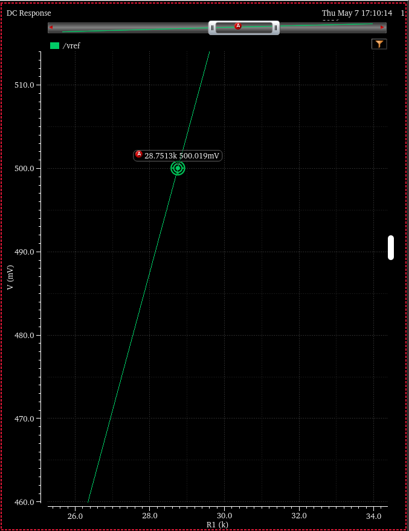
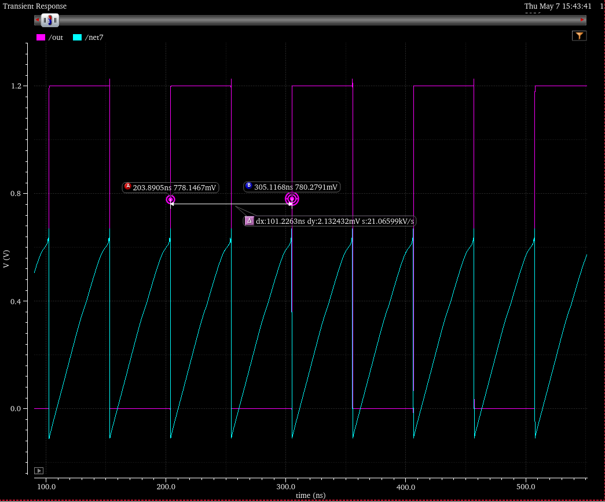
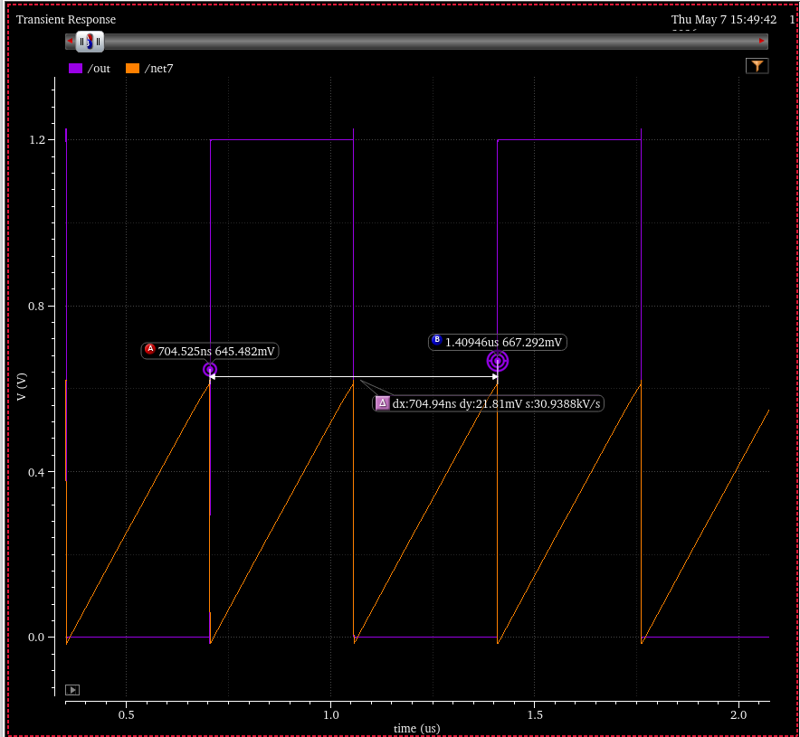
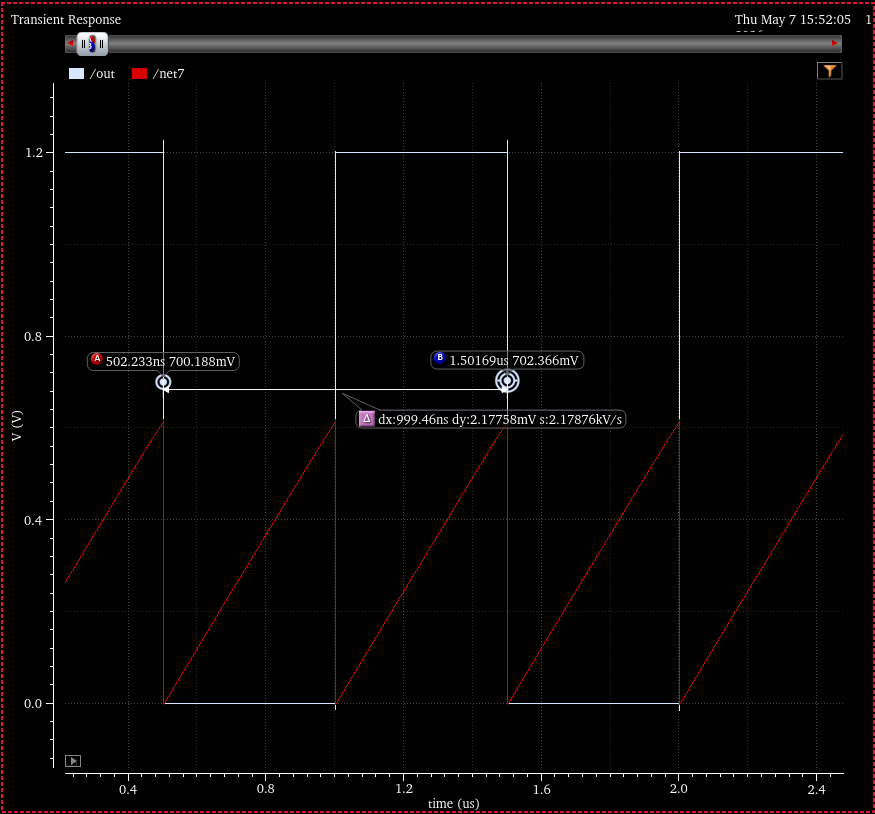
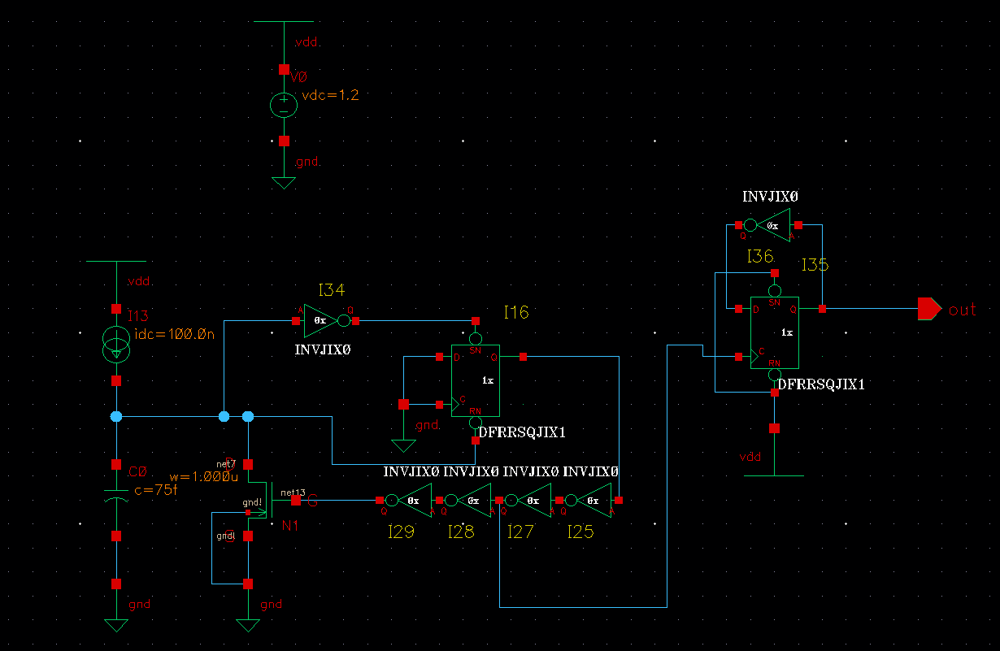

# Compte-rendu - Projet ADC SAR

<!-- Pour lancer Cadebce 
cp -r ~galayko/cours_EACN/projet/cadence_amsC35_projEACN .
cd cadence_ihp_sg13g2/cds
tcsh
env_sg13g2.csh
virtuoso&
-->

<!--Contraintes
ADC SAR 4 bits
Transistors CMOS, 0.13 um, 1.2V
-->

## ADC SAR
<!-- TODO voir pourquoi Durant ce cycle1, le comparateur analyse la tension Vcomp, la
décision ne sera prise qu'au cycle suivant POURQUOI??? répondre!! -->

<!-- TODO VOIR PARTIE voir partie 7 du sujet (page 3)-->
<!-- TODO INTEGRATION DU BLOC SUR CADENCE-->

### VHDL
On décrit le comportement du controleur des interrupteurs qui permet générer la sortie sur 4 bits.

### Banc de test VHDL
<!-- TODO faire testbench -->

### Chronogrammes de simulation
<!-- TODO mettre chronogrammes simulation et expliquer -->

### Séquencement de conversion
<!-- TODO expliquer le déroulement de la conversion -->

Il reste à faire un circuit pour générer vref = 2vcm et le générateur d'horloge.

## Comparateur

### Étude du schéma
<!-- TODO schéma du comparateur -->

### Simulation transitoire
<!-- TODO simulations transitoires -->
vin- 500mv

### Mesure de l'offset
<!-- TODO mesures d'offset -->
<!-- TODO chronogrammes -->
Pour mesurer l'offset, on va simuler une rampe avec une tension ayant une période de 1 seconde et d'amplitude 450 à 550 mV que l'on va appliquer à Vinp.\
On va comparer Vinp à Vinn fixe à 500 mv.\

On lance donc une simulation transitoire de 0 à 100 microsecondes en faisant apparaître la tension Vinp et Vout en fonction du temps.

On mesure alors que le comparateur a un décalage de 16 mv lors du basculement, il s'effectue lorsque Vinn est à 516mv au lieu de 500mv.

### Analyse des performances
<!-- TODO analyse performances -->

### Intégration sur ADC et conclusion
<!-- TODO intégration bloc sur ADC-->
<!-- TODO conclusion technique -->

### Questions
<!-- TODO  Pourquoi un comparateur dynamique consomme-t-il peu de puissance statique ?-->
<!-- TODO Quel est l’effet du mismatch transistor sur l’offset ?-->
<!-- TODO Pourquoi le latch r´eg´en´eratif acc´el`ere-t-il la d´ecision ?-->
<!-- TODO Quel est l’impact de l’offset sur la pr´ecision du SAR ADC ?-->
<!-- TODO Comment r´eduire l’offset du comparateur ?-->

## Génération des tensions de référence
<!--TODO Faire BANDGAP et COMPRENDRE LE CIRCUIT !!! -->

### Choix de la résistance R1
La valeur de R1 doit être ajustée afin d'obtenir une tension de sortie de 500mV à 30 degrés Celcius.\
On définit donc la température à 30 degré en haut à gauche de la fenêtre de simulation Maestro.\
On fait une simulation DC en affichant la tension de sortie *Vref* en fonction de la résistance *R1* variant de 1 000 à 50 000 avec un pas de 100.

On peut donc observer que la valeur de R1 qui permet d'obtenir une tension de sortie de 500mV est d'environ 28.75kOhms.

### Doubleur de tension

## Générateur d'horloge
On cherche à obtenir une fréquence de 1MHz.\
Pour différentes valeurs de la capacité on obtient les périodes d'horloge suivante:

Pour 1 femtofarad

La période de 100 ns est trop courte, on a une fréquence de 100MHz.\
On multiplie la capacité.

Pour 50 femtofarad:

La période est toujours trop courte, on ajuste encore la capacité.

Pour 75 femtofarad:

La période correspond à 1us ce qui nous fait une fréquence de 1MHz.

Voici le circuit implémenté pour générer l'horloge:
